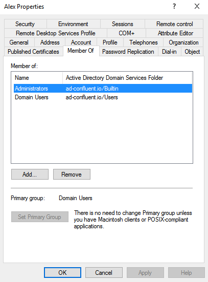
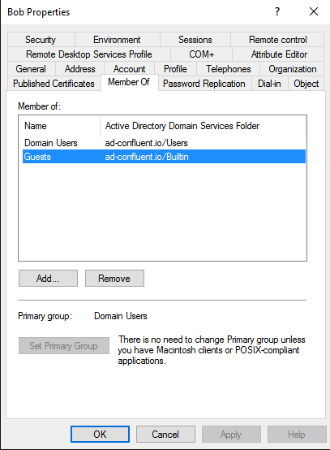
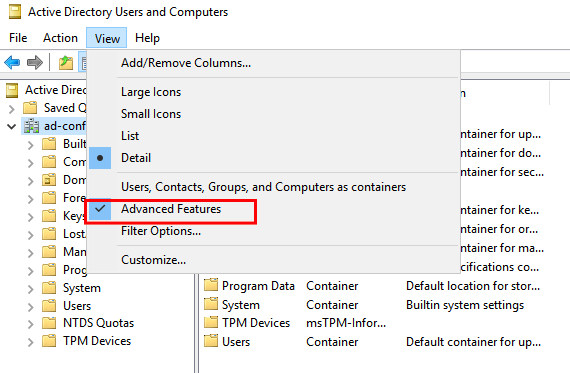
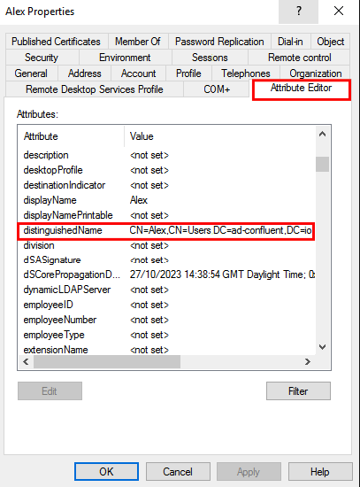
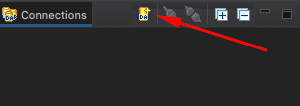
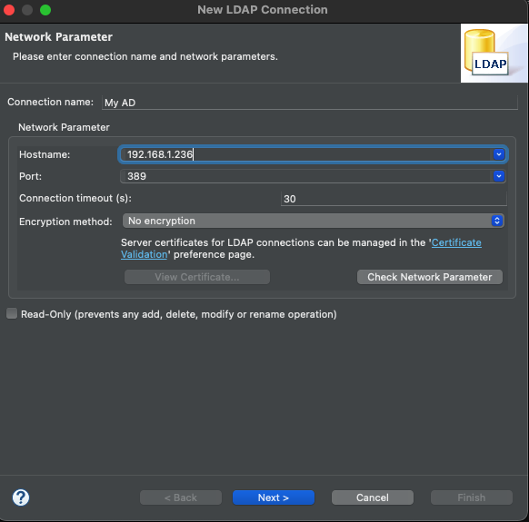
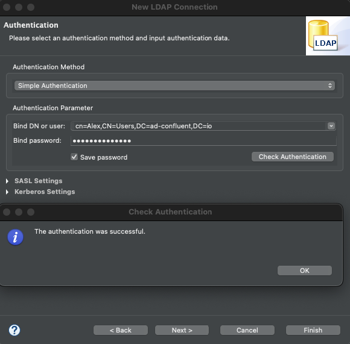
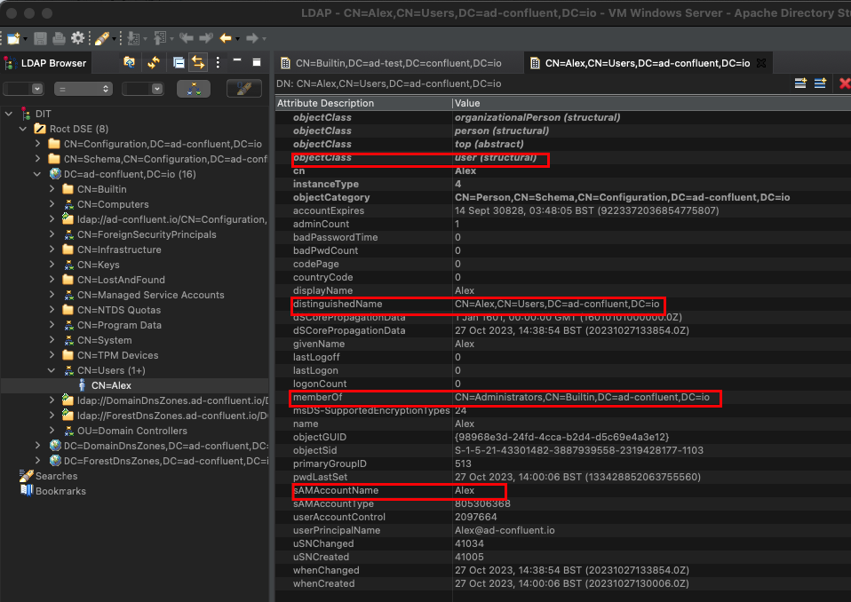

# Confluent Control Center (C3) with Windows Server Active Directory

An example project to demonstrate the integration between Confluent Control Center (C3) and Windows Active Directory, using AD Groups to control access to the groups.

This will provide all the necessary steps for setting up Confluent Platform's Control Center (C3) to use simple Active Directory authorization.  The configuration is documented here:

<https://docs.confluent.io/platform/current/control-center/security/c3-auth-ldap.html>

## A note for Windows Server 2022

The following steps illustrate an in-depth walkthrough for setting up Windows Server 2022:

<https://github.com/ableasdale/confluent-dockerfiles/tree/main/simple-active-directory-c3>

## Getting Started

This walkthrough has been tested with a VirtualBox installation of a trial version of Windows Server 2019, with Active Directory Services installed and with the VM being promoted to an AD Domain Controller.

Two users have been set up in Active Directory (in Windows Server, run `dsa.msc` to access the `Active Directory Users and Computers` component).  

- **Alex** is a member of the **Administrators** group and will have **full** access to Confluent Control Center (C3)
- **Bob** is a member of the **Guests** group and has **read-only** access

### Alex



### Bob



## Configuration

There are two sections of configuration of note:

The `control-center` container is being configured with the following parameters:

```yaml
      # For LDAP
      CONTROL_CENTER_REST_AUTHENTICATION_ROLES: Administrators,Guests
      CONTROL_CENTER_AUTH_RESTRICTED_ROLES: Guests
      CONTROL_CENTER_REST_AUTHENTICATION_METHOD: BASIC
      CONTROL_CENTER_REST_AUTHENTICATION_REALM: c3
      CONTROL_CENTER_OPTS: -Djava.security.auth.login.config=/tmp/jaas.conf
```

And the `jaas.conf` file will look similar to this:

```javascript
c3 {
  org.eclipse.jetty.jaas.spi.LdapLoginModule required

  useLdaps="false"
  contextFactory="com.sun.jndi.ldap.LdapCtxFactory"
  hostname="winldap"
  port="389"
  bindDn="CN=Alex,CN=Users,DC=ad-confluent,DC=io"
  bindPassword="Password123456"
  authenticationMethod="simple"
  forceBindingLogin="true"
  userBaseDn="CN=Users,DC=ad-confluent,DC=io"
  userRdnAttribute="cn"
  userIdAttribute="sAMAccountName"
  userPasswordAttribute="userPassword"
  userObjectClass="user" 
  roleBaseDn="CN=Builtin,DC=ad-confluent,DC=io"
  roleNameAttribute="CN"
  roleMemberAttribute="member" 
  roleObjectClass="group"
  reportStatistics="true"
  debug="true";
};
```

In order to configure out the `Distinguished Name` (DN) entries, you can use the `Attribute Editor` in `Active Directory Users and Computers`; to do that, you need to ensure that `Advanced Features` is set under the `View` menu:



From there you can use the `Attribute Editor` tab and find the `distinguishedName` property for your user:



### Testing Connectivity with LDAPSearch

You can use the `ldapsearch` tool to search the LDAP directory; the format for the command looks like this:

```bash
ldapsearch -x -b <search_base> -H <ldap_host>
```

Where the following switches are:

- **-x**         Simple authentication
- **-b** basedn  base dn for search
- **-H** URI     LDAP Uniform Resource Identifier(s)
- **-D** binddn  bind DN
- **-W**         prompt for bind password

Here's an example using the setup created in this walkthrough:

```bash
ldapsearch -x -b "CN=Users,DC=ad-confluent,dc=io" -H ldap://192.168.1.236 -D "cn=Alex,CN=Users,DC=ad-confluent,DC=io" -W
```

If the command ran successfully, you should something like this at the end of the output returned:

```
# search result
search: 2
result: 0 Success
```

### Using Apache Directory Studio

Another useful resource is Apache Directory Studio:

<https://directory.apache.org/studio/>

Once installed, the LDAP connection can be set up to your Active Directory instance by locating the `Connections` panel and clicking on the `New Connection` icon:



From there, you can enter the hostname (or IP address):



And set the `Bind DN` and `Password`:



Note that you have the option to test the connection at this stage.

From there, you can access a signficant amount of metadata associated with your `Users` and `Groups` - which should help with any further configuration:



## Troubleshooting

First, make sure the volumes have been mounted on the `control-center` instance and ensure that you can access the `jaas.conf` file:

```bash
docker-compose exec control-center bash
```

```bash
cd /tmp/
cat jaas.conf
```

### Debug level logging

You can add `-Djava.security.debug=all -Djava.security.auth.debug=all -Dorg.eclipse.jetty.util.log.IGNORED=true` to your `CONTROL_CENTER_OPTS` in your `docker-compose.yaml` file to get more fine-grained logging (this setting is included in the provided `docker-compose.yaml` file):

```properties
CONTROL_CENTER_OPTS: -Djava.security.auth.login.config=/tmp/jaas.conf -Djava.security.debug=all -Djava.security.auth.debug=all -Dorg.eclipse.jetty.util.log.IGNORED=true
```

For a successful login (with Debug logging configured), you will see the following entries from the `LdapLoginModule`:

```log
control-center   | 	[LoginContext]: org.eclipse.jetty.jaas.spi.LdapLoginModule loaded via reflection
control-center   | 	[LoginContext]: org.eclipse.jetty.jaas.spi.LdapLoginModule login success
control-center   | 	[LoginContext]: org.eclipse.jetty.jaas.spi.LdapLoginModule commit success
control-center   | [2023-10-27 14:38:15,066] INFO Attempting authentication: CN=Alex,CN=Users,DC=ad-confluent,DC=io (org.eclipse.jetty.jaas.spi.LdapLoginModule)
control-center   | [2023-10-27 14:38:15,070] INFO Attempting authentication: CN=Alex,CN=Users,DC=ad-confluent,DC=io (org.eclipse.jetty.jaas.spi.LdapLoginModule)
control-center   | 	[LoginContext]: org.eclipse.jetty.jaas.spi.LdapLoginModule login success
control-center   | 	[LoginContext]: org.eclipse.jetty.jaas.spi.LdapLoginModule commit success
control-center   | 	[LoginContext]: org.eclipse.jetty.jaas.spi.LdapLoginModule loaded via reflection
control-center   | 	[LoginContext]: org.eclipse.jetty.jaas.spi.LdapLoginModule login success
control-center   | 	[LoginContext]: org.eclipse.jetty.jaas.spi.LdapLoginModule commit success
```
